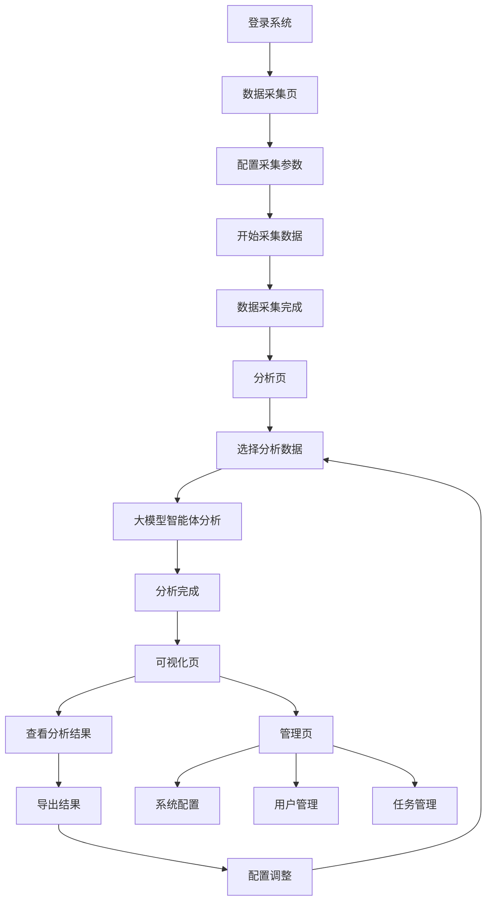

## 1. Product Overview
社交媒体评论情感分析系统是一个基于大模型智能体的分析工具，用于采集和分析微博、抖音等平台的用户评论数据。
- 该系统旨在通过情感极性识别与强度分析，为舆情监测、品牌口碑分析提供技术支撑。
- 目标用户包括企业品牌管理人员、舆情监测机构、市场研究人员等需要了解公众对特定话题或品牌态度的专业人士。

## 2. Core Features

### 2.1 User Roles
| Role | Registration Method | Core Permissions |
|------|---------------------|------------------|
| Admin | Local account | Full access to all features, including data collection, analysis, and system management |
| User | Local account | Access to basic analysis features and results viewing |

### 2.2 Feature Module
1. **数据采集模块**：支持多平台评论采集，数据清洗与预处理
2. **大模型智能体分析模块**：情感分析、关键词提取、舆情追踪
3. **可视化展示模块**：情感分布、舆情趋势、关键词云展示
4. **后台管理模块**：系统配置、用户管理、任务管理

### 2.3 Page Details
| Page Name | Module Name | Feature description |
|-----------|-------------|---------------------|
| 数据采集页 | 平台选择 | 支持选择微博、抖音等平台，设置采集参数 |
| 数据采集页 | 采集配置 | 配置关键词、时间范围、采集数量等参数 |
| 数据采集页 | 数据管理 | 查看已采集数据，支持导出和删除 |
| 分析页 | 情感分析 | 对评论进行情感极性识别和强度分析 |
| 分析页 | 关键词提取 | 挖掘评论中的高频核心词汇，实现主题词聚类 |
| 分析页 | 舆情追踪 | 基于时间维度分析情感趋势与关键词变化 |
| 可视化页 | 情感分布 | 展示情感分布饼图，直观显示正面、负面、中性评论比例 |
| 可视化页 | 舆情趋势 | 展示舆情趋势折线图，显示不同时间段的情感变化 |
| 可视化页 | 关键词云 | 展示高频关键词云，突出显示重要主题词 |
| 可视化页 | 评论样本 | 展示代表性评论样本，支持按情感类型筛选 |
| 管理页 | 系统配置 | 配置模型参数、API密钥等系统设置 |
| 管理页 | 用户管理 | 管理用户账号和权限 |
| 管理页 | 任务管理 | 管理分析任务，查看任务状态和历史记录 |

## 3. Core Process
用户使用系统的主要流程如下：
1. 用户登录系统，进入数据采集页
2. 配置采集参数，选择平台和关键词，开始采集数据
3. 采集完成后，进入分析页，选择要分析的数据
4. 系统使用大模型智能体对数据进行分析，包括情感分析、关键词提取和舆情追踪
5. 分析完成后，用户进入可视化页查看分析结果
6. 用户可以导出分析结果或进行进一步的配置调整

## 4. User Interface Design
### 4.1 Design Style
- 主色调：蓝色系 (#165DFF)，代表专业和可信赖
- 辅助色：绿色 (#00B42A) 表示正面情感，红色 (#F53F3F) 表示负面情感，灰色 (#86909C) 表示中性情感
- 按钮风格：圆角矩形，有轻微的阴影效果
- 字体：无衬线字体，主标题 18px，副标题 16px，正文 14px
- 布局风格：卡片式布局，顶部导航栏，左侧功能菜单
- 图标风格：线性图标，简洁现代

### 4.2 Page Design Overview
| Page Name | Module Name | UI Elements |
|-----------|-------------|-------------|
| 数据采集页 | 平台选择 | 卡片式选择器，每个平台有对应的图标和名称，选中状态有高亮效果 |
| 数据采集页 | 采集配置 | 表单输入框，时间选择器，滑块控件，保存按钮 |
| 数据采集页 | 数据管理 | 表格展示，分页控件，导出按钮，删除按钮 |
| 分析页 | 情感分析 | 下拉选择框，分析按钮，进度条，结果展示区 |
| 分析页 | 关键词提取 | 结果展示区，聚类可视化 |
| 分析页 | 舆情追踪 | 时间范围选择器，趋势图表 |
| 可视化页 | 情感分布 | 饼图，图例，百分比显示 |
| 可视化页 | 舆情趋势 | 折线图，时间轴，数据点交互 |
| 可视化页 | 关键词云 | 词云图，字体大小表示频率，颜色表示情感 |
| 可视化页 | 评论样本 | 卡片式展示，情感标签，筛选控件 |
| 管理页 | 系统配置 | 表单输入框，开关控件，保存按钮 |
| 管理页 | 用户管理 | 表格展示，添加/编辑/删除按钮 |
| 管理页 | 任务管理 | 表格展示，任务状态指示，操作按钮 |

### 4.3 Responsiveness
- 设计采用桌面优先原则，同时支持平板和移动设备
- 在小屏幕设备上，左侧菜单会折叠为顶部下拉菜单
- 图表和表格会根据屏幕宽度自动调整大小和布局
- 支持触摸操作，按钮和交互元素大小适合手指点击

### 4.4 3D Scene Guidance
- 本系统不需要3D场景