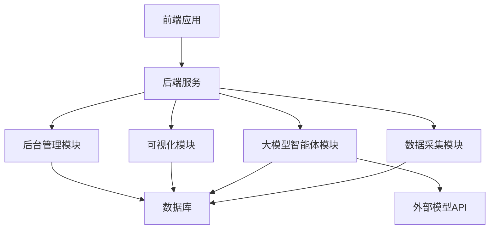
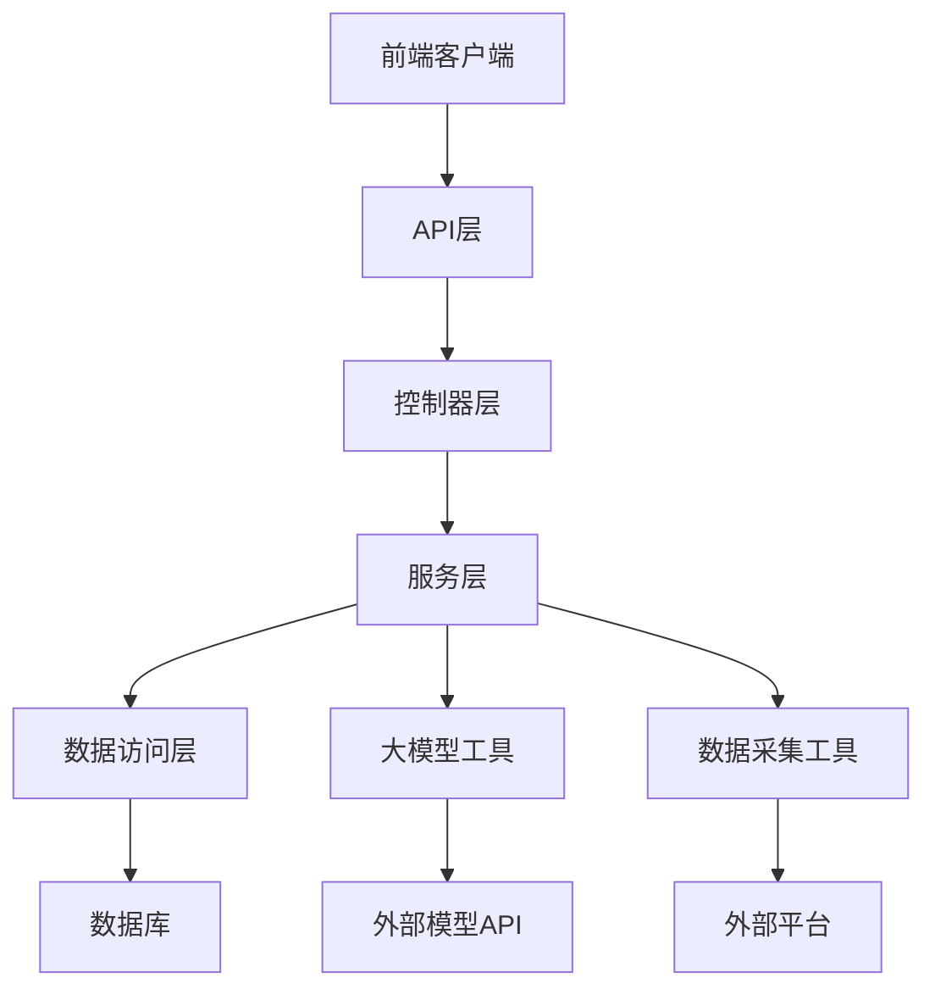
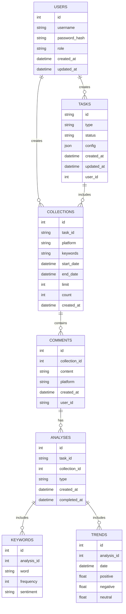

## 1. Architecture Design


## 2. Technology Description
- 前端：Vue 3 + TypeScript + Tailwind CSS + ECharts
- 初始化工具：Vite
- 后端：FastAPI + Python
- 数据库：SQLite (本地演示) / MySQL (生产环境)
- 大模型：LangChain + 开源大模型 (Llama/Baichuan/Qwen)
- 数据采集：Python + Requests + Selenium
- 数据处理：Pandas + NumPy
- 模型微调：Hugging Face Transformers + PEFT (LoRA)
- 向量存储：FAISS

## 3. Route Definitions
| Route | Purpose |
|-------|---------|
| / | 系统首页 |
| /login | 登录页面 |
| /collection | 数据采集页 |
| /analysis | 分析页 |
| /visualization | 可视化页 |
| /management | 后台管理页 |

## 4. API Definitions

### 4.1 数据采集API
| Endpoint | Method | Description | Request Body | Response |
|----------|--------|-------------|-------------|----------|
| /api/collection/platforms | GET | 获取支持的平台列表 | N/A | `{"platforms": ["weibo", "douyin"]}` |
| /api/collection/start | POST | 开始采集数据 | `{"platform": "weibo", "keywords": ["关键词1", "关键词2"], "start_date": "2023-01-01", "end_date": "2023-01-31", "limit": 100}` | `{"task_id": "task_123", "status": "started"}` |
| /api/collection/status | GET | 获取采集任务状态 | `{"task_id": "task_123"}` | `{"status": "completed", "count": 100}` |
| /api/collection/data | GET | 获取采集的数据 | `{"task_id": "task_123", "page": 1, "page_size": 20}` | `{"data": [{"id": 1, "content": "评论内容", "platform": "weibo", "created_at": "2023-01-01 12:00:00"}], "total": 100, "page": 1, "page_size": 20}` |
| /api/collection/export | POST | 导出采集数据 | `{"task_id": "task_123", "format": "csv"}` | `{"url": "/exports/task_123.csv"}` |

### 4.2 分析API
| Endpoint | Method | Description | Request Body | Response |
|----------|--------|-------------|-------------|----------|
| /api/analysis/sentiment | POST | 情感分析 | `{"data_ids": [1, 2, 3]}` | `{"results": [{"id": 1, "content": "评论内容", "sentiment": "positive", "score": 0.9}]}` |
| /api/analysis/keywords | POST | 关键词提取 | `{"data_ids": [1, 2, 3]}` | `{"keywords": [{"word": "关键词", "frequency": 10, "sentiment": "positive"}]}` |
| /api/analysis/trend | POST | 舆情趋势分析 | `{"data_ids": [1, 2, 3], "time_range": "day"}` | `{"trends": [{"date": "2023-01-01", "positive": 0.6, "negative": 0.2, "neutral": 0.2}]}` |

### 4.3 管理API
| Endpoint | Method | Description | Request Body | Response |
|----------|--------|-------------|-------------|----------|
| /api/management/users | GET | 获取用户列表 | N/A | `{"users": [{"id": 1, "username": "admin", "role": "admin"}]}` |
| /api/management/users | POST | 创建用户 | `{"username": "user1", "password": "password123", "role": "user"}` | `{"id": 2, "username": "user1", "role": "user"}` |
| /api/management/users/{id} | PUT | 更新用户 | `{"username": "user1", "password": "newpassword", "role": "user"}` | `{"id": 2, "username": "user1", "role": "user"}` |
| /api/management/users/{id} | DELETE | 删除用户 | N/A | `{"status": "success"}` |
| /api/management/tasks | GET | 获取任务列表 | N/A | `{"tasks": [{"id": "task_123", "type": "collection", "status": "completed", "created_at": "2023-01-01 12:00:00"}]}` |
| /api/management/tasks/{id} | GET | 获取任务详情 | N/A | `{"id": "task_123", "type": "collection", "status": "completed", "created_at": "2023-01-01 12:00:00", "result": {"count": 100}}` |
| /api/management/tasks/{id} | DELETE | 删除任务 | N/A | `{"status": "success"}` |
| /api/management/config | GET | 获取系统配置 | N/A | `{"model_name": "llama2", "api_key": "...", "max_tokens": 1000}` |
| /api/management/config | PUT | 更新系统配置 | `{"model_name": "llama2", "api_key": "...", "max_tokens": 1000}` | `{"model_name": "llama2", "api_key": "...", "max_tokens": 1000}` |

## 5. Server Architecture Diagram


## 6. Data Model

### 6.1 Data Model Definition


### 6.2 Data Definition Language

```sql
-- 创建用户表
CREATE TABLE users (
    id INTEGER PRIMARY KEY AUTOINCREMENT,
    username TEXT UNIQUE NOT NULL,
    password_hash TEXT NOT NULL,
    role TEXT NOT NULL DEFAULT 'user',
    created_at TIMESTAMP DEFAULT CURRENT_TIMESTAMP,
    updated_at TIMESTAMP DEFAULT CURRENT_TIMESTAMP
);

-- 创建任务表
CREATE TABLE tasks (
    id TEXT PRIMARY KEY,
    type TEXT NOT NULL,
    status TEXT NOT NULL DEFAULT 'pending',
    config TEXT NOT NULL,
    created_at TIMESTAMP DEFAULT CURRENT_TIMESTAMP,
    updated_at TIMESTAMP DEFAULT CURRENT_TIMESTAMP,
    user_id INTEGER,
    FOREIGN KEY (user_id) REFERENCES users (id)
);

-- 创建采集表
CREATE TABLE collections (
    id INTEGER PRIMARY KEY AUTOINCREMENT,
    task_id TEXT NOT NULL,
    platform TEXT NOT NULL,
    keywords TEXT NOT NULL,
    start_date TIMESTAMP NOT NULL,
    end_date TIMESTAMP NOT NULL,
    limit INTEGER NOT NULL,
    count INTEGER DEFAULT 0,
    created_at TIMESTAMP DEFAULT CURRENT_TIMESTAMP,
    FOREIGN KEY (task_id) REFERENCES tasks (id)
);

-- 创建评论表
CREATE TABLE comments (
    id INTEGER PRIMARY KEY AUTOINCREMENT,
    collection_id INTEGER NOT NULL,
    content TEXT NOT NULL,
    platform TEXT NOT NULL,
    created_at TIMESTAMP NOT NULL,
    user_id TEXT,
    FOREIGN KEY (collection_id) REFERENCES collections (id)
);

-- 创建分析表
CREATE TABLE analyses (
    id INTEGER PRIMARY KEY AUTOINCREMENT,
    task_id TEXT NOT NULL,
    collection_id INTEGER NOT NULL,
    type TEXT NOT NULL,
    created_at TIMESTAMP DEFAULT CURRENT_TIMESTAMP,
    completed_at TIMESTAMP,
    FOREIGN KEY (task_id) REFERENCES tasks (id),
    FOREIGN KEY (collection_id) REFERENCES collections (id)
);

-- 创建关键词表
CREATE TABLE keywords (
    id INTEGER PRIMARY KEY AUTOINCREMENT,
    analysis_id INTEGER NOT NULL,
    word TEXT NOT NULL,
    frequency INTEGER NOT NULL,
    sentiment TEXT NOT NULL,
    FOREIGN KEY (analysis_id) REFERENCES analyses (id)
);

-- 创建趋势表
CREATE TABLE trends (
    id INTEGER PRIMARY KEY AUTOINCREMENT,
    analysis_id INTEGER NOT NULL,
    date TIMESTAMP NOT NULL,
    positive REAL NOT NULL,
    negative REAL NOT NULL,
    neutral REAL NOT NULL,
    FOREIGN KEY (analysis_id) REFERENCES analyses (id)
);

-- 创建索引
CREATE INDEX idx_comments_collection_id ON comments (collection_id);
CREATE INDEX idx_analyses_collection_id ON analyses (collection_id);
CREATE INDEX idx_keywords_analysis_id ON keywords (analysis_id);
CREATE INDEX idx_trends_analysis_id ON trends (analysis_id);

-- 插入默认管理员用户
INSERT INTO users (username, password_hash, role) VALUES ('admin', '$2b$12$EixZaYVK1fsbw1ZfbX3OXePaWxn96p36WQoeG6Lruj3vjPGga31lW', 'admin');
```